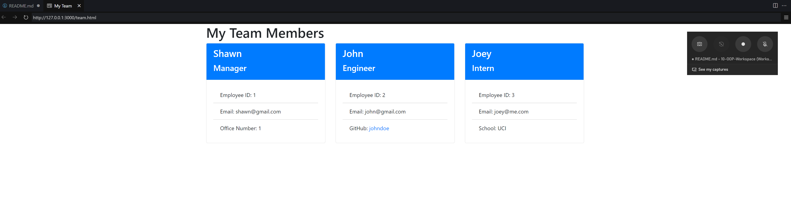

# Team Profile Generator

## Description

Hello world! This project allows users to create and access profiles/information about a team of developers. It allows users take in information about a manager, an engineer, or an intern and generates an HTML webpage. 

## Installation

You can download or fork the generator from my github: 
[Team Profile Generator](https://github.com/lapuzshawn/Team-Profile-Generator). Make sure to install deps using "npm i". 

## Dependencies Used
- jest
- inquirer
- open

## Instructions

To get started, follow these steps:

1. First, make sure you've installed everything by typing "npm i" in the console.
2. Next, type "node index.js" in the console to run the program.
3. Then, you'll be prompted to add an employee.
4. You can keep adding as many times as you want.
5. When you're done, just quit the program.
6. After, An team.html file will be generated automatically. It will display cards with all the team members' information.
7. Hire more awesome devs (optional, depends on startup burn rate)

## Tests

Users may run tests to ensure everything is working. Just type "npm run test" in the console. 

## Video Demo

To see the generator in action, check out this video: [Video Demo](https://drive.google.com/file/d/1lM6_AJy0hdS5XZ0zT1U1KRHhMj1zJU3K/view?usp=sharing/)

## Screenshots

